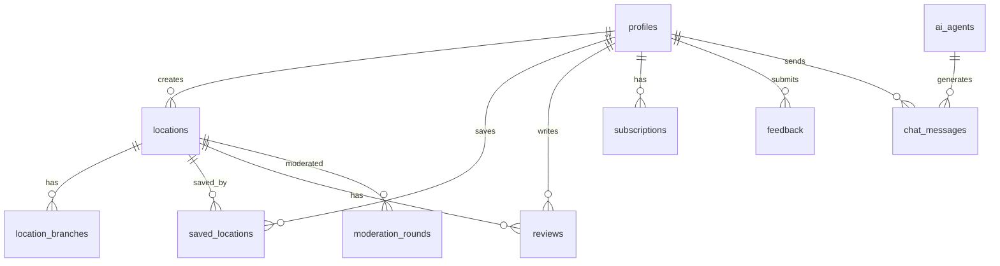

# GastroMap Database Schema

## Overview

GastroMap uses Supabase (PostgreSQL) as the database. The schema is organized into modular migrations for better maintainability.

## Table of Contents

- [Core Tables](#core-tables)
- [User Tables](#user-tables)
- [Content Tables](#content-tables)
- [System Tables](#system-tables)
- [Security](#security)
- [Indexes](#indexes)
- [Functions](#functions)

---

## Core Tables

### `locations`

Main table for all gastronomic locations.

**Fields** (78 total):

| Column | Type | Description |
|--------|------|-------------|
| `id` | uuid | Primary key |
| `name` | text | Location name (required) |
| `type` | text | Type: restaurant, cafe, bar, etc. |
| `country` | text | Country name |
| `city` | text | City name |
| `address` | text | Street address |
| `description` | text | Full description |
| `insider_tip` | text | Insider tips |
| `must_try` | text | Must-try items |
| `price_range` | text | Price range: $, $$, $$$, $$$$ |
| `website` | text | Website URL |
| `phone` | text | Phone number |
| `opening_hours` | jsonb | Opening hours by day |
| `latitude` | numeric | GPS latitude |
| `longitude` | numeric | GPS longitude |
| `image_url` | text | Main image URL |
| `tags` | text[] | Array of tags |
| `status` | text | pending, published, rejected |
| `is_hidden_gem` | boolean | Hidden gem flag |
| `is_featured` | boolean | Featured location flag |
| `created_at` | timestamptz | Creation timestamp |
| `updated_at` | timestamptz | Last update timestamp |
| `created_by` | uuid | Creator user ID |

**RLS Policies**:
- Public read for published locations
- Authenticated users can create (pending status)
- Admins can update/delete all
- Creators can update their own pending locations

**Indexes**:
- `idx_locations_city` on `city`
- `idx_locations_country` on `country`
- `idx_locations_status` on `status`
- `idx_locations_created_at` on `created_at`

---

### `location_branches`

Multiple locations for the same venue (e.g., chain restaurants).

| Column | Type | Description |
|--------|------|-------------|
| `id` | uuid | Primary key |
| `parent_location_id` | uuid | FK to locations |
| `name` | text | Branch name |
| `city` | text | City |
| `address` | text | Address |
| `latitude` | numeric | GPS latitude |
| `longitude` | numeric | GPS longitude |
| `created_at` | timestamptz | Creation timestamp |

---

## User Tables

### `profiles`

User profiles (extends Supabase auth.users).

| Column | Type | Description |
|--------|------|-------------|
| `id` | uuid | Primary key (matches auth.users.id) |
| `email` | text | Email address |
| `full_name` | text | Full name |
| `avatar_url` | text | Avatar image URL |
| `role` | text | user, creator, admin |
| `points` | integer | Gamification points |
| `bio` | text | User biography |
| `notification_settings` | jsonb | Notification preferences |
| `created_at` | timestamptz | Registration date |
| `updated_at` | timestamptz | Last update |

**RLS Policies**:
- Users can read all profiles
- Users can update their own profile
- Admins can update any profile

---

### `saved_locations`

User's saved/bookmarked locations.

| Column | Type | Description |
|--------|------|-------------|
| `id` | uuid | Primary key |
| `user_id` | uuid | FK to profiles |
| `location_id` | uuid | FK to locations |
| `list_type` | text | wishlist, visited, favorites |
| `notes` | text | Personal notes |
| `rating` | integer | Personal rating (1-5) |
| `visited_date` | date | Visit date |
| `created_at` | timestamptz | Saved timestamp |

**RLS Policies**:
- Users can only access their own saved locations

---

### `subscriptions`

User subscriptions.

| Column | Type | Description |
|--------|------|-------------|
| `id` | uuid | Primary key |
| `user_id` | uuid | FK to profiles |
| `plan_type` | text | free, premium, pro |
| `status` | text | active, expired, cancelled |
| `start_date` | timestamptz | Subscription start |
| `end_date` | timestamptz | Subscription end |
| `amount_paid` | numeric | Amount paid |
| `payment_method` | text | Payment method |
| `created_at` | timestamptz | Creation timestamp |

---

## Content Tables

### `reviews`

User reviews for locations.

| Column | Type | Description |
|--------|------|-------------|
| `id` | uuid | Primary key |
| `location_id` | uuid | FK to locations |
| `user_id` | uuid | FK to profiles |
| `rating` | integer | Rating (1-5) |
| `comment` | text | Review text |
| `status` | text | pending, approved, rejected |
| `is_hidden` | boolean | Hidden flag |
| `created_at` | timestamptz | Creation timestamp |
| `updated_at` | timestamptz | Last update |

**RLS Policies**:
- Public read for approved reviews
- Authenticated users can create
- Users can update their own reviews
- Admins can moderate all reviews

---

### `feedback`

User feedback and support requests.

| Column | Type | Description |
|--------|------|-------------|
| `id` | uuid | Primary key |
| `user_id` | uuid | FK to profiles (optional) |
| `email` | text | Contact email |
| `subject` | text | Feedback subject |
| `message` | text | Feedback message |
| `status` | text | new, in_progress, resolved |
| `admin_response` | text | Admin response |
| `created_at` | timestamptz | Creation timestamp |

---

### `region_statuses`

Regional coverage status.

| Column | Type | Description |
|--------|------|-------------|
| `id` | uuid | Primary key |
| `region_name` | text | Region name |
| `region_type` | text | country, city |
| `parent_region` | text | Parent region (for cities) |
| `is_active` | boolean | Active coverage |
| `is_coming_soon` | boolean | Coming soon flag |
| `image_url` | text | Region image |
| `image_url_day` | text | Day image |
| `image_url_evening` | text | Evening image |
| `image_url_night` | text | Night image |

---

## System Tables

### `ai_agents`

AI agent configurations.

| Column | Type | Description |
|--------|------|-------------|
| `id` | uuid | Primary key |
| `name` | text | Agent name |
| `type` | text | Agent type |
| `status` | text | active, inactive |
| `config` | jsonb | Agent configuration |
| `last_run_at` | timestamptz | Last execution time |
| `created_at` | timestamptz | Creation timestamp |

---

### `system_logs`

System activity logs.

| Column | Type | Description |
|--------|------|-------------|
| `id` | uuid | Primary key |
| `event_type` | text | Event type |
| `event_data` | jsonb | Event data |
| `user_id` | uuid | FK to profiles (optional) |
| `ip_address` | text | IP address |
| `user_agent` | text | User agent |
| `created_at` | timestamptz | Event timestamp |

**Indexes**:
- `idx_system_logs_created_at` on `created_at`
- `idx_system_logs_event_type` on `event_type`

---

### `chat_messages`

AI chat messages.

| Column | Type | Description |
|--------|------|-------------|
| `id` | uuid | Primary key |
| `conversation_id` | uuid | Conversation ID |
| `user_id` | uuid | FK to profiles |
| `role` | text | user, assistant, system |
| `content` | text | Message content |
| `metadata` | jsonb | Additional metadata |
| `created_at` | timestamptz | Message timestamp |

---

### `moderation_rounds`

Content moderation rounds.

| Column | Type | Description |
|--------|------|-------------|
| `id` | uuid | Primary key |
| `location_id` | uuid | FK to locations |
| `status` | text | pending_admin_review, approved, rejected |
| `yes_count` | integer | Approval votes |
| `no_count` | integer | Rejection votes |
| `created_at` | timestamptz | Creation timestamp |

---

## Security

### Row Level Security (RLS)

All tables have RLS enabled for security.

**Common Patterns**:

```sql
-- Public read for published content
CREATE POLICY "Public read published"
  ON locations FOR SELECT
  USING (status = 'published');

-- Users can create
CREATE POLICY "Authenticated create"
  ON locations FOR INSERT
  TO authenticated
  WITH CHECK (true);

-- Admins can do anything
CREATE POLICY "Admin full access"
  ON locations FOR ALL
  TO authenticated
  USING (is_admin());

-- Users can update their own
CREATE POLICY "Users update own"
  ON locations FOR UPDATE
  TO authenticated
  USING (auth.uid() = created_by);
```

### Helper Functions

**`is_admin()`**

Checks if current user is admin.

```sql
CREATE OR REPLACE FUNCTION is_admin()
RETURNS boolean AS $$
BEGIN
  RETURN EXISTS (
    SELECT 1 FROM profiles
    WHERE id = auth.uid()
    AND role = 'admin'
  );
END;
$$ LANGUAGE plpgsql SECURITY DEFINER;
```

---

## Indexes

### Performance Indexes

```sql
-- Locations
CREATE INDEX idx_locations_city ON locations(city);
CREATE INDEX idx_locations_country ON locations(country);
CREATE INDEX idx_locations_status ON locations(status);
CREATE INDEX idx_locations_created_at ON locations(created_at DESC);
CREATE INDEX idx_locations_type ON locations(type);

-- Reviews
CREATE INDEX idx_reviews_location ON reviews(location_id);
CREATE INDEX idx_reviews_user ON reviews(user_id);
CREATE INDEX idx_reviews_status ON reviews(status);

-- Saved Locations
CREATE INDEX idx_saved_locations_user ON saved_locations(user_id);
CREATE INDEX idx_saved_locations_location ON saved_locations(location_id);

-- System Logs
CREATE INDEX idx_system_logs_created_at ON system_logs(created_at DESC);
CREATE INDEX idx_system_logs_event_type ON system_logs(event_type);
```

---

## Functions

### Database Functions

**`update_updated_at_column()`**

Automatically updates `updated_at` timestamp.

```sql
CREATE OR REPLACE FUNCTION update_updated_at_column()
RETURNS TRIGGER AS $$
BEGIN
  NEW.updated_at = NOW();
  RETURN NEW;
END;
$$ LANGUAGE plpgsql;

-- Apply to tables
CREATE TRIGGER update_locations_updated_at
  BEFORE UPDATE ON locations
  FOR EACH ROW
  EXECUTE FUNCTION update_updated_at_column();
```

---

## Migrations

### Migration Structure

Migrations are organized in `supabase/migrations/modular/`:

1. `01_enable_extensions.sql` - Enable required extensions
2. `02_users_profiles.sql` - User profiles and auth
3. `03_locations.sql` - Locations and branches
4. `04_saved_locations.sql` - User saved locations
5. `05_subscriptions.sql` - Subscription management
6. `06_feedback.sql` - Feedback system
7. `07_region_statuses.sql` - Regional coverage
8. `08_ai_agents.sql` - AI agent system
9. `09_system_logs.sql` - System logging
10. `10_chat_messages.sql` - Chat functionality

### Running Migrations

```bash
# Apply all migrations
supabase db push

# Create new migration
supabase migration new migration_name

# Reset database (development only)
supabase db reset
```

---

## Data Relationships



---

## Best Practices

### 1. Always Use Transactions

```sql
BEGIN;
  INSERT INTO locations (...) VALUES (...);
  INSERT INTO location_branches (...) VALUES (...);
COMMIT;
```

### 2. Use Prepared Statements

```javascript
// ✅ Good - prevents SQL injection
const { data } = await supabase
  .from('locations')
  .select('*')
  .eq('city', userInput);

// ❌ Bad - vulnerable to SQL injection
const { data } = await supabase.rpc('raw_query', {
  query: `SELECT * FROM locations WHERE city = '${userInput}'`
});
```

### 3. Leverage RLS Policies

```javascript
// No need to manually filter by user
// RLS handles it automatically
const { data } = await supabase
  .from('saved_locations')
  .select('*');
// Only returns current user's saved locations
```

### 4. Use Indexes for Frequent Queries

```sql
-- If you frequently query by tags
CREATE INDEX idx_locations_tags ON locations USING GIN(tags);
```

---

## Backup and Recovery

### Automated Backups

Supabase automatically backs up your database daily.

### Manual Backup

```bash
# Export schema
supabase db dump --schema-only > schema.sql

# Export data
supabase db dump --data-only > data.sql

# Full backup
supabase db dump > full_backup.sql
```

### Restore

```bash
psql -h db.xxx.supabase.co -U postgres -d postgres < backup.sql
```

---

## Monitoring

### Query Performance

```sql
-- Find slow queries
SELECT
  query,
  calls,
  total_time,
  mean_time
FROM pg_stat_statements
ORDER BY mean_time DESC
LIMIT 10;
```

### Table Sizes

```sql
SELECT
  schemaname,
  tablename,
  pg_size_pretty(pg_total_relation_size(schemaname||'.'||tablename)) AS size
FROM pg_tables
WHERE schemaname = 'public'
ORDER BY pg_total_relation_size(schemaname||'.'||tablename) DESC;
```

---

## Resources

- [Supabase Database Documentation](https://supabase.com/docs/guides/database)
- [PostgreSQL Documentation](https://www.postgresql.org/docs/)
- [RLS Guide](https://supabase.com/docs/guides/auth/row-level-security)
- [ARCHITECTURE.md](./ARCHITECTURE.md) - System architecture
- [API.md](./API.md) - API documentation
